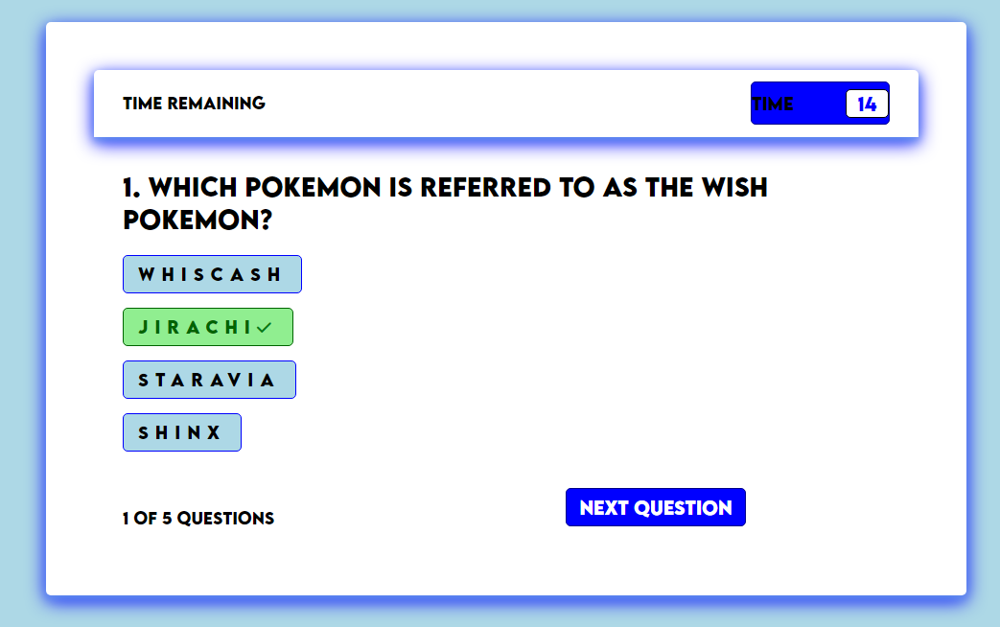

# Pokemon Quiz

## Description

- My motivation for this project was to create a FUNctional quiz based on Pokemon facts.
- I built this project to further utilize the knowledge I've gained on JavaScript and create a visually pleasing page.
- This code is an easy and fun quiz that uses HTML, CSS, and JavaScript for its appearance and functionality.
- Composing this quiz, I learned many more things about JavaScript, such as how to utilize displays to show and hide different elements on a page using a button.

## Github & Deployed Site
- [Github Repository](https://github.com/Celyph/pokemon-quiz)
- [Deployed Site](https://celyph.github.io/pokemon-quiz/)

## Usage

## Credits

I used the ReadMe guide from [https://coding-boot-camp.github.io/full-stack/github/professional-readme-guide](https://coding-boot-camp.github.io/full-stack/github/professional-readme-guide).